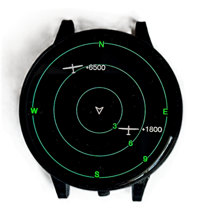
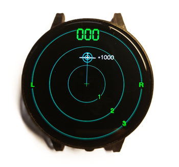
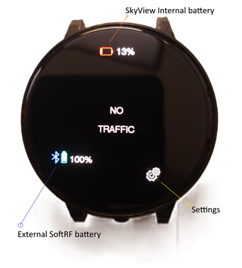
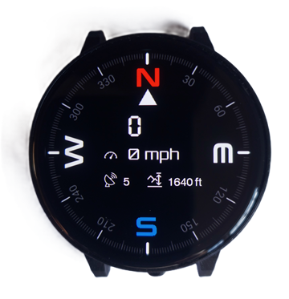
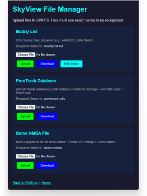
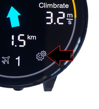

# SkyView User Manual

## Table of Contents
- [Introduction](#introduction)
- [Getting Started](#getting-started)
- [Display Screens](#display-screens)
- [Features](#features)
  - [Buddy List & Labels](#buddy-list--labels)
  - [Vertical Separation Display](#vertical-separation-display)
  - [Proximity Alerting](#proximity-alerting)
  - [Tap on Target Aircraft](#tap-on-target-aircraft)
  - [Battery Management](#battery-management)
- [Device Controls](#device-controls)
  - [Mode/Power Button](#modepower-button)
- [Bluetooth LE Management](#bluetooth-le-management)
- [Web Interface](#web-interface)
  - [Accessing the Web Interface](#accessing-the-web-interface)
  - [Uploading Buddy List](#uploading-buddy-list)
  - [Firmware Updates](#firmware-updates)
- [Settings](#settings)
- [Troubleshooting](#troubleshooting)

---

## Introduction

SkyView is a traffic awareness device for aviation that displays air traffic data received from EC radio devices (like SoftRF SenseCap T1000-E Card) and visualizes FLARM NMEA or Garmin GDL90 data on round AMOLED displays.

**Compatible Hardware:**
- LILYGO AMOLED 1.75" T-Display
- Waveshare AMOLED 1.75" H0175Y003AM display

**Compatible Traffic Sources:**
- SoftRF SenseCap T1000-E (via Bluetooth LE)
- XC Tracer (via Bluetooth LE)
- FLARM POwerMouse (via NMEA over WiFi/Serial)
- SkyEcho
- Stratux
- PilotAware

---

## Getting Started

1. **Power On Your Device**
   - Long press (>2 seconds) the Mode/Power button to turn on SkyView.
   - When device is in "Storage Sleep" mode, it requires plugging USB-C charger to wake up.
   - The device will boot up and display the Radar screen.

2. **Connect Your Traffic Source** >>Important. 
   - For Bluetooth devices: Follow the [Bluetooth LE Management](#bluetooth-le-management) section to pair your SoftRF or other FLARM/FANET device.
   - For WiFi/Serial connections: Configure connection settings via the web interface.

3. **View Traffic**
   - Aircraft will appear on the Radar screen as they come within range.
   - Use the Mode button to cycle through different display screens.

---

## Display Screens

SkyView offers three main display screens that you can cycle through using the Mode button:

1. **Radar Screen** - Visual representation of traffic around you with distance rings and aircraft symbols
2. **Traffic Info** - Detailed information about nearby aircraft
3. **Compass Screen** - Navigation compass display (can be disabled in Settings)

**Screen Navigation:**
- Short press the Mode button to cycle: Radar → Traffic Info → Compass → Radar
- If Compass is disabled in Settings, screens alternate: Radar ⇄ Traffic Info
- Swipe left/right on the touchscreen to navigate between screens


---
## Traffic Info screen


---

## Features

### Buddy List & Labels

Identify known pilots easily on the Radar Screen. Buddies are displayed with special indicators to help you quickly recognize friends and familiar aircraft.

**Buddy Display Features:**
- **White blinking dot** indicator on buddy aircraft
- **Initials** displayed next to the aircraft symbol
- **Circle (dot) icon** marking buddy aircraft


**Managing Buddy Labels:**
- Buddy labels can be enabled or disabled from the on-screen Settings Page
- See [Managing Buddy List](#managing-buddy-list) for instructions on adding buddies

---

### Vertical Separation Display

Get enhanced situational awareness with vertical separation information displayed directly on the Radar Screen.

**Relative Altitude Display:**
- Altitude shown next to aircraft symbols (for Gliders, Helicopters, and General Aviation)
- **Paraglider Color Coding:**
  - **Cyan** - Aircraft is above you
  - **Green** - Aircraft is below you
  - **Red** - Aircraft at same height (±500ft)



> **Note:** Paragliders use color coding instead of numeric altitude display.

---

### Proximity Alerting

Stay alert to nearby traffic with visual proximity warnings that help you maintain safe separation.

**Alert Indicators:**
- **Blinking circles** around aircraft that are close both vertically and horizontally
- **Look-up direction line** drawn from Radar center to the aircraft
- Visual warnings help you quickly locate traffic in your vicinity



---

### Tap on Target Aircraft

Interactive touch functionality allows you to focus on specific aircraft and view detailed information.

**How to Use:**
1. **Tap on aircraft** in the Radar screen to bring up its Info Card
2. The Info Card becomes **locked** to this aircraft (indicated by a small green lock icon)
3. The aircraft card remains displayed as long as the aircraft is in view
4. **To switch aircraft:** Tap the green lock icon to unlock, then tap another aircraft
5. **To return to Radar:** Swipe left


**Lock Feature:**

- When green , is indicating that the Info page will always switch to this aircraft (if in range)
- When airctaft out of range, screen will flip to any other visible aircraft or "No Traffic" message
- When airctaft is back, the screen will automaticall switch back to the locked aircraft
- To chnage the locked aircraft, swipe up or down to chnage to next page, it will lock on to next aircraft


---

### Battery Management

Advanced battery management system with improved charging and monitoring capabilities.

**Battery Features:**

1. **Smart Charging**
   - Slower charging rate to improve battery life and longevity
   - Lower charging current near 100% for optimal energy absorption
   - Charge indicator icon shows charging status and full charge state
   - **Be patient:** Charge until the icon disappears and battery icon turns green

2. **Battery Status Icons**
   - **SkyView battery indicator** - Shows internal battery level
   - **External BLE device battery** - Displays battery status of connected devices (e.g., SoftRF T1000E)

3. **Battery Logging**
   - Automatic log stored for each battery discharge cycle
   - Track how long battery lasted from full to low
   - Battery logs retrievable via web interface for analysis




## Device Controls

### Mode/Power Button

The Mode/Power button provides essential device control functions.

**Power Controls:**
- **Power On:** Long press (>2 seconds) while device is in sleep mode
  - Device will not accidentally power on with momentary button presses

**Power Down Options:**
- Hold button for 2 seconds it will bring power down options
- **Sleep Mode:** Puts device into low-power sleep, can be woken by button
- **Storage Sleep:** Deep sleep mode, requires USB power to wake
> **Note:** Use Full Shutdown when keeping it powered off for longer than a day


---


---
## Compass page

**GPS based Comapss**

- Shows Heading track
- Altitude
- Speed
- Number of satellites received



> Note: you must be moving for compass to update
---

## Bluetooth LE Management

SkyView connects only to **paired BLE devices** for security and reliability, preventing unwanted connections on busy takeoffs.

### Pairing a Bluetooth Device

1. **Connect to SkyView WiFi**
   - Power on your SkyView device
   - Connect your computer or phone to the SkyView WiFi access point
   - WiFi is available for 10 minutes after powering on
   - **Default WiFi Password:** `12345678`

2. **Access the Web Interface**
   - Open your web browser
   - Navigate to [http://192.168.1.1](http://192.168.1.1)

   

3. **Pair Your Device**
   - Click the **BLE Manage** button
   - Click **Scan for BLE devices**
   - The scan will show only FLARM/FANET-capable devices
   - Click **Add** next to your SoftRF device
   - Device is now paired!

   

4. **Managing Paired Devices**
   - You can **Remove** previously paired devices on the same page
   - Only paired devices will automatically connect to SkyView

**Benefits:**
- Prevents connection to random devices on crowded takeoffs
- NimBLE stack provides improved power efficiency
- Optimized scanning shows only relevant devices

---

## Web Interface

The SkyView web interface provides easy access to configuration, firmware updates, and file management.

### Accessing the Web Interface

1. **Connect to SkyView WiFi**
   - Power on SkyView
   - WiFi access point is available for 10 minutes after boot
   - SSID: `SkyView-XXXXXX` (where XXXXXX is your device ID)
   - Password: `12345678` (default)

2. **Open Web Browser**
   - Navigate to: [http://192.168.1.1](http://192.168.1.1)
   - The SkyView web interface will load

### Managing Buddy List

Add pilot buddies to your device for easy identification on the Radar screen.
You can update buddy list directly via the web interface.
**Buddy List File Format:**

- Each line contains: `HEX_ID,Pilot Name`
- Hex ID and name separated by a comma

To edit buddy list directly on teh web page.
**Edit Steps:**
1. Access the SkyView web interface
2. Navigate to the **Upload files** page

3. Under Buddy List section click Edit Online button
4. You can add/remove buddies in the text area
5. Buddy labels will appear on the Radar screen

 

Alternativly, you can download, edit and upload a buddy list file.

**Download/ Upload Steps:**
1. Access the SkyView web interface
2. Navigate to the file upload page
3. Select your `buddylist.txt` file
4. Click Upload
5. Buddy labels will appear on the Radar screen

**Example `buddylist.txt`:**
```
200ABC,Chrigel Maurer
1F00C1,Paul Guschlbauer
```


> **Note:** A sample buddy list file is included with SkyView releases.

### Firmware Updates

Keep your SkyView up to date with the latest features and improvements.

**Update Process:**

1. **Download Firmware**
   - Get the latest firmware `.bin` file from the [SkyView GitHub releases page](https://github.com/slash-bit/SkyView-AMOLED-round-1.75-TFT_eSPI/tree/main/binaries)

2. **Access Web Interface**
   - Connect to SkyView WiFi
   - Open browser to [http://192.168.1.1](http://192.168.1.1)

3. **Upload Firmware**
   - Navigate to firmware update page (Update firmware button)
   - Select the `.bin` firmware file
   - Click Upload
   - Wait for update to complete (device will restart automatically)

**Video Tutorial:**
- Watch the firmware update video: [https://youtu.be/NbYAM7KYvmo](https://youtu.be/NbYAM7KYvmo)

**Latest Firmware Versions:**
- [Release](https://github.com/slash-bit/SkyView-AMOLED-round-1.75-TFT_eSPI/releases) (Latest)


---

## Settings pages

Access on-device settings by navigating to the Settings page 

(from Info page > tap cogs icon).


**Available Settings:**

- **Traffic Filters** - Filter aircraft types to display
- **Show thermals** - Showes coloured dots when paraglider climbing
- **Radar North Up** - North-Up or Track-Up radar orientation
- **Show Labels** - Enable/disable showing buddy initials on Radar page


- **Compass Page** - Enable/disable Compass screen in rotation
- **Voice Alerts** - Enable/disable Traffic announcements ( in Audio enabled device)
- **Power Options** - Brings [Power Options Menu](#modepower-button) ( the same as long button press)

**Navigation:**
- Swipe up/down to scroll through settings
- Tap options to change values
- Changes are saved automatically

---

## Troubleshooting

### WiFi Access Point Not Available
- WiFi AP is only available for 10 minutes after power-on
- Restart device and connect within 10 minutes
- Default password is `12345678`

### Bluetooth Device Won't Connect
- Ensure device is paired via BLE Manage page
- Only paired devices can connect
- Check that BLE device is powered on and in range
- Remove and re-add device if connection issues persist

### No Traffic Displayed
- Verify BLE/Serial/WiFi connection to traffic source
- Check that traffic source is receiving data
- Ensure SkyView is configured for correct protocol (NMEA/GDL90)
- Check connection status on web interface

### Battery Not Charging
- Use appropriate USB-C cable and charger
- Charging is deliberately slower for battery health
- Wait until green battery icon appears (full charge)
- Check battery logs via web interface if issues persist

### Device Won't Power On
- Ensure long press (>2 seconds) on power button
- Check battery charge level
- Try connecting to USB power

### Screen Timeout
- Radar screen updates every 5 seconds
- Text view times out after 7 seconds
- Touch screen to wake display
- Adjust timeout settings in Settings page

---

## Version History

### VB006 (Latest)
- Revamped battery/power management using SY6970 chip
- NimBLE Bluetooth stack for reduced power consumption
- Tap on aircraft to see details and lock Info Card
- Battery charging improvements and logging
- External BLE device battery status display

### VB005
- Managed BLE connections (paired devices only)
- Improved Mode/Power button (long press to power on/off)
- Enhanced power management

### VB004
- Vertical separation display on Radar
- Color-coded altitude for paragliders
- Proximity alerting with visual indicators
- Improved graphics rendering and speed
- Blinking buddy indicators

### VB003
- Buddy list and labels feature
- Web interface for buddy list upload
- Buddy identification on Radar screen
- Firmware update via web interface

---

## Support & Resources

**GitHub Repository:**
- [SkyView AMOLED GitHub](https://github.com/slash-bit/SkyView-AMOLED-round-1.75-TFT_eSPI)

**Firmware Downloads:**
- [Latest Firmware Binaries](https://github.com/slash-bit/SkyView-AMOLED-round-1.75-TFT_eSPI/tree/main/binaries)

**Video Tutorials:**
- [Firmware Update Tutorial](https://youtu.be/NbYAM7KYvmo)

**Documentation:**
- See the `Documentation` folder for additional guides
- Buddy list management guide
- Flashing and getting started instructions

---

**Manual Version:** 1.0 (Based on firmware releases VB003-VB006)
**Last Updated:** 2025

---
